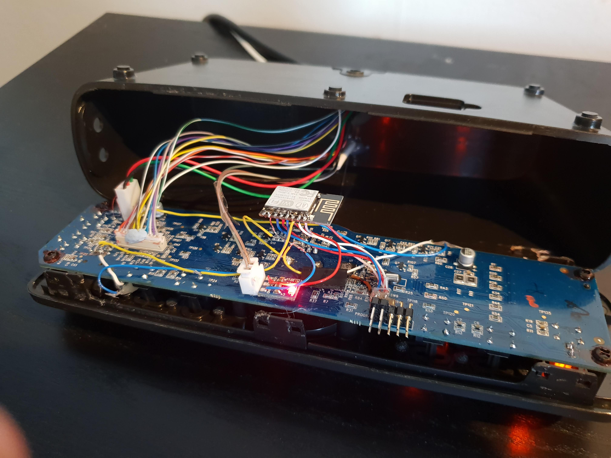

# Logitech Zmart906
Breathe new life into your Logitech Z906 Surround system with this ESP8266-hack 
.

### Version 2.0
I've worked on version 2.0 of this project which intercepts the UART traffic between the controller and the subwoofer (that actually controls the sound and input settings). This makes the hack much more reliable as the ESP does not have to track the state of the sounds system.

As soon as I have some spare time I'll upload the next version complete with instructions on how to install, set it up, and use it. Since version 2.0 is coming, I'm not going to write an in-depth guide on how to install, set up, and use this version. However, the source code is here if you would like to look at it and set it up yourself. 

# Installation
**DISCLAIMER: You are doing this at your own risk. I will not take responsibility if you break your system!**
As stated above, since version 2.0 is on its way I will not write a more thorough installation guide than this. However, feel free to contact me if you need any help.

Note: You don't actually have to open up the controller to use this hack. You could build the ESP8266 system and point the IR LED towards the IR receiver on the outside of the Logitech controller.

## Prerequisites

* Knowledge about Ardunio, the ESP8266 chip, and platformio
* Hardware: soldering iron
* The guts to pry open the case and solder extra components onto the circuit board

## Partlist
- ESP8266
- IR LED
- An appropriate voltage source (5v -> 3.3v)

The easiest way to flash the ESP8266 with the firmware is with platformio.
The controller board does not have enough oomph to power both the controller board and the ESP8266. Thus you will have to route an extra cable to the controller to deliver power to the ESP8266.

The IR LED should be pointed to the IR receiver inside the Logitech controller box.

# Usage
The ESP8266 can control the sound system through a REST API or through MQTT. In both cases, the payload is a json document. Have a look at the source code to see what the json document should look like.

Depending on the json payload you can:
- Turn on/off the system
- Change sound levels (main levels, bass level, and tweeter levels)
- Change the sound input
- Change sound mode (Surround, Stereo, and Music)
